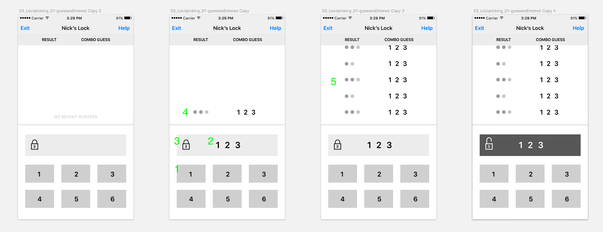

# PickPocket App - Fall 2017

PickPocket is an app based on the game [Mastermind](ultimate-mastermind-rules.pdf). Players try to guess the correct combination of numbers to crack a lock. After each guess, players are given feedback on the number of digits in their guess that are correct or misplaced. The previous guesses a player made and and results of those guesses are also displayed. Players can either play against the computer, or try to crack the locks of other players.

## Getting Started
1. Check out this [link](https://docs.google.com/a/intrepid.io/document/d/1Wywului461Y45yPI0grVbXJd6oj6FukvSLCbRmFJaLw/edit?usp=sharing), which describes the game logic in more detail.
1. Fork this repo
    - Navigate to the top-right corner of this page and click the Fork button.
    - All the work you'll do on this project will be done on your fork - no commits or pull requests should be made on the repo owned by `IntrepidPursuits`
1. Clone your fork to your computer
    - Navigate to your repo in Github. The repo name at the top of the page should be `<your-github-username> / pick-pocket-ios` and underneath it, it should say forked from `IntrepidPursuits / pick-pocket-ios`.
    - On the right side of the page, there is a green button that says "Clone or download". Click it and copy the link that appears
    - Open up Terminal and navigate to the directory you want your copy of the repo to be in. Run the following command:
        ```
         git clone <paste link you copied here>
        ```
    The full command should look like: `git clone https://github.com/<your-github-username>/pick-pocket-ios.git`
1. Open up the project in Xcode and build and run

## Project Overview:

You'll complete the project in incremental steps, putting up at least one pull request (PR) per step listed below. The PRs should be put up against your own repo, not against this one. If you're having difficulty with that, ask your mentor for help. They will be the one reviewing your PR. In PR reviews, they will provide feedback on how to make your code better and how to adhere to Intrepid's best practices and style guide. After making the suggested changes, you'll merge your PR and move onto the next step.

Remember, this is not a race or competition. We would prefer you complete a few sections using proper architecture and coding style rather than rush through the project but end up with a tangled web of untestable code. This is a learning experience.

## Steps

For each step below, you should put up a PR with the changes you made to implement it. PRs should not include more than one step, and multiple PRs can be made for one step if there are a lot of changes.

1. [Create Models](#1-create-models) - Create models that encapsulate the game logic.
1. [Create UI](#2-create-ui) - Create a UI that allows you to play a one-way Mastermind game against a computer opponent.
1. [Previous Guesses](#3-previous-guesses) - Add a list of previous guesses to the UI to make it easier to remember what you’ve already guessed.
1. [Networking](#4-networking) - Add a networking class that allows you to crack a remote lock using an API.

### 1. Create Models

These models are included in the starter project. Start by implementing the `submit` function.
```Swift
struct Lock {
    let code: String
    func submit(guess: String) -> PickPocketResult {
        return PickPocketResult(correct: 0, misplaced: 0)
    }
}

struct PickPocketResult {
    let correct: Int
    let misplaced: Int
}
```

As you can see, a `Lock` can be initialized with a code. You can then get a `PickPocketResult` back by submitting a guess `String`. The `PickPocketResult` will contain hints for `correct` and `misplaced` digits.

In addition to creating the models, you will also want to write unit tests that verify that the game logic is working correctly.

### 2. Create UI



Create a UI based on the above wireframe. It doesn’t have to match it exactly, but use it as a guide for what features to include.

1. Add six buttons that will allow the user to input digits 1-6. We will keep the number of buttons static for now, but imagine that we could change the number of buttons in the future!
2. Whenever the user presses a button, a digit should be added to a readout.
3. There should be some UI that indicates whether or not you have guessed correctly. If you have not yet guessed correctly, you should display a locked lock emoji :lock:. If you submit a correct guess the lock will be opened :unlock:. The lock should display the number of digits in the combination.
4. Once you enter the number of digits in the combo, your guess will be submitted. You should receive feedback based on your guess. You should see the numberCorrect ⚫ and the numberMisplaced ⚪.

This is a perfect opportunity to use Model-View-ViewModel ([MVVM](https://www.objc.io/issues/13-architecture/mvvm/)) architecture. You should create a ViewModel class that receives user input from the digit buttons. Once enough digits have been collected, the ViewModel should use its internal models to submit a guess and calculate a `PickPocketResult`. The ViewModel exposes representations of the `correct` and `misplaced` members of `PickPocketResult` in an emoji format. It also exposes an emoji to indicate whether you have cracked the code. You will want to write unit tests that verify that the correct hint string is returned for the correct input.

### 3. Previous Guesses

Expand your view model or create a different one to display your past attempts. See #5 in the wireframe.

### 4. Networking

Add a networking class that allows you to crack a single remote lock using an API. We'll call this class `RequestManager`. `RequestManager` should be a [singleton](http://krakendev.io/blog/the-right-way-to-write-a-singleton). `RequestManager` should use URLSession or [Alamofire](https://github.com/Alamofire/Alamofire) to make HTTP requests. You should use a library like [Genome](https://github.com/LoganWright/Genome) for the JSON parsing. `RequestManager` should return all data asynchronously to its callers via a callback closure. Here is the interface you should use for `RequestManager`:

```swift
static let sharedInstance = RequestManager()

func post(guess: String,
          userID: String,
          userToPick: String,
          completion: @escaping ((Intrepid.Result<PickPocketResult>) -> Void)) {}
```

You will need to use Intrepid's [Swift Wisdom](https://github.com/IntrepidPursuits/swift-wisdom) library in order to access the `Result` enum that is used in the `post` function.

At this stage we're ready to start cracking remote locks! You'll need to create a client class to send requests to the API. The base URL of the PickPocket API is:

https://5gbad1ceal.execute-api.us-east-1.amazonaws.com/release

The first thing you'll want to do is send a POST request to the endpoint /picklock/{victim} with the following body:

```json
{
    "token": "1e32c098-93cf-11e7-8bf1-e29045b92989",
    "guess": "[2,3,2]"
}
```

The `{victim}` in the URL is the user whose lock you are trying to crack. You can use the username `Paul` to test against the 'guess' 232.  The `token` in the JSON body is a unique
identifier created by the server when a new user is added.  We will provide you with starter values for these items when you get to this step. You should probably test
out this web request in an app like [Postman](https://www.getpostman.com/) before adding it to your app.

**Important** - Once you introduce the ability to crack both local and remote locks you will have to update the original `Lock` and `PickPocketResult` [models](#create-models).

Note: The above libraries should be added in using Cocoapods.

## Next Steps

If you finish the steps given above, go talk to the person running the project or to your mentor about next steps.
